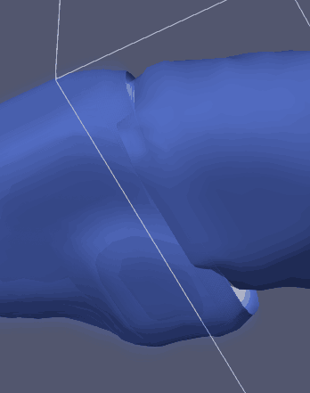

# 实验结果
以比较大的004.obj为例
  
> 所有obj已经打包发送到老师的qq，所以老师直接点击obj即可打开。

## 实验问题
- 其实有两种Padding

- [x] 为了防止断裂的padding
```C++
1. 由于我们marching cube是基于某一个文件的，所以第一个体数据从0开始到127结束，共128个。那么第二个体数据
同样必须从127开始254结束，共128个。也即重复一个。
```
>如果没有重复就会导致：
  

- [x] 为了防止不能耦合的padding 
```C++
2. 由于我们需要contour等值线，所以我们必须对体数据进行average,分块之后，average有多少你就必须加多少为average服务的padding。
```
> 如果不加这个average的padding的话：
  


我们加了以上两个padding,同时加大加粗防止断裂的padding，直接设成6个，每一边三个。在这种情况下，达到了如下效果：
  
  
 1](../images/91dffc44914a72fcc03d016c36aaaa0a5fa4fc8ec50460b137f56534cfe02616.png)  
肉眼已经很难分辨出是否闭合了，即使放的非常近，也无法用肉眼看出了。但是水密性问题并未得到验证。
